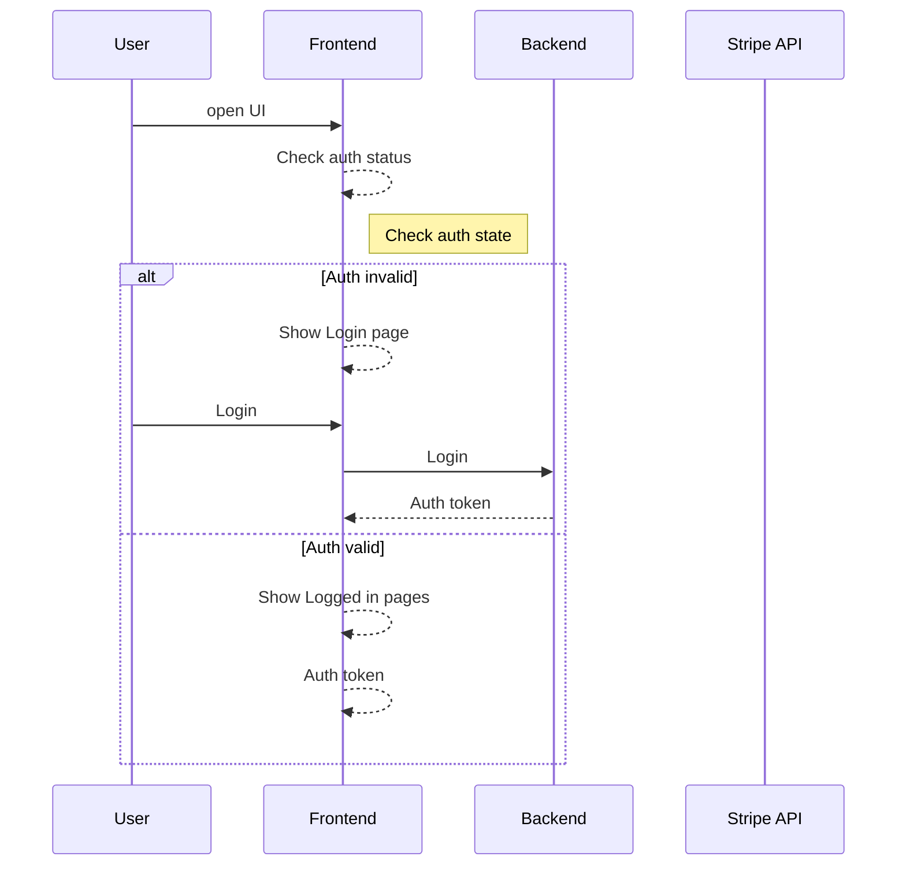
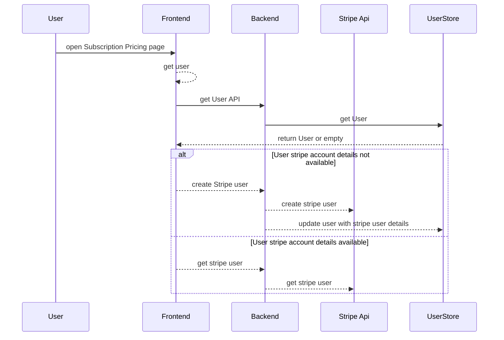
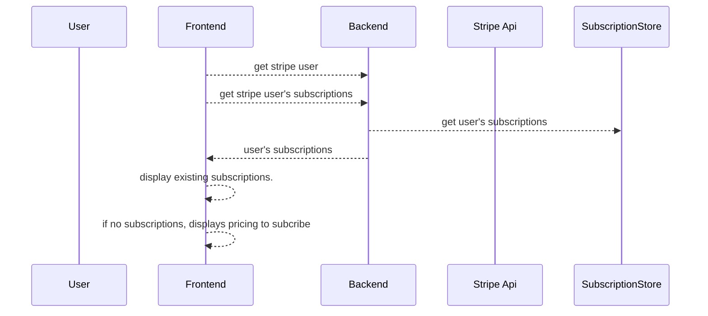

# Stripe subscription 

## How Subscription work 

https://stripe.com/docs/billing/subscriptions/overview

* Landing page
    - User create on backendd
    - User create on stripe. receive(customerid)

* Pricing page 
    - Display the products and pricing option retrived from stripe. receive (priceid)

* Payment page
    - Collect billing details and payment details 
        - create new subscription ( customerid, priceid )
        - generate invoice for initial subscription cycle
        - collects payment details and pays your invoice 
        - sets the payment method as default payment method for subscription.

* Provisioning page
    - confirmation page 
    - provision product access to the customer
        - verify status of subscription is 'active'

    - Handle webhooks called by stripe about subscriptions and payments    

## Build a subscription integration

https://stripe.com/docs/billing/subscriptions/build-subscriptions?ui=elements#collect-payment

User auth flow

User's stripe user get and create

User's excisting subscriptions

